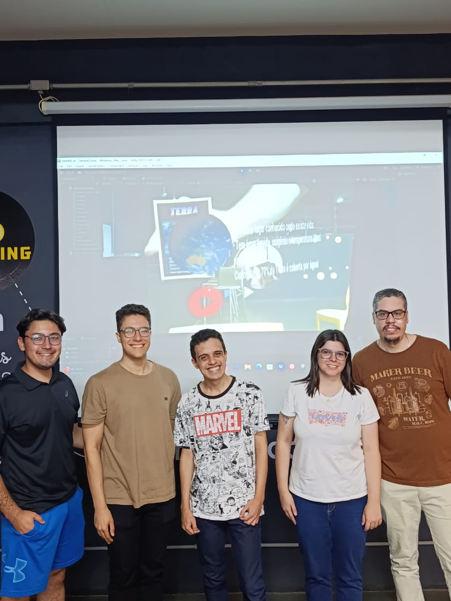
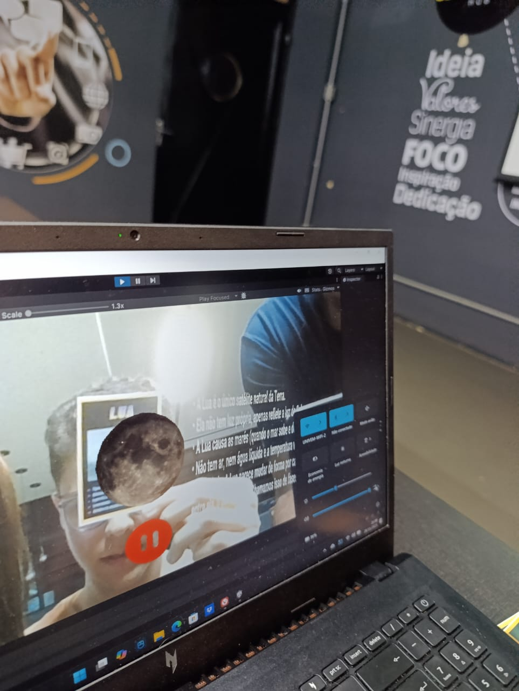
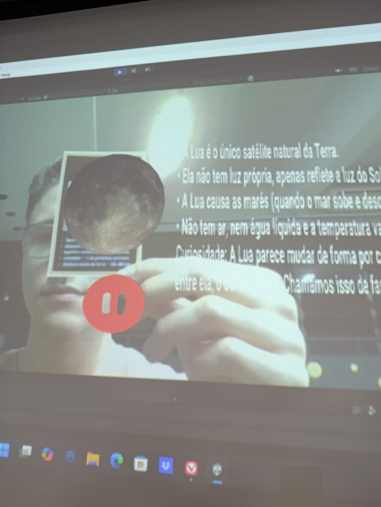
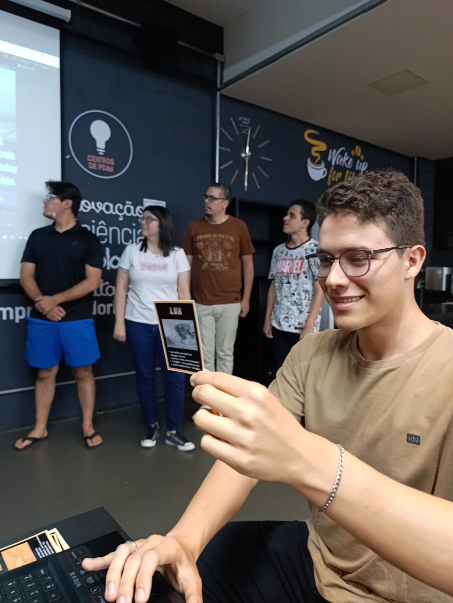
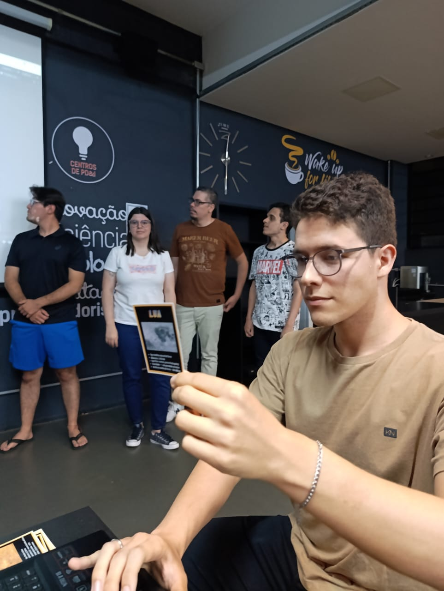

[](https://www.youtube.com/watch?v=w3Ruo5g0vvE)

# Planets AR

This is our final project for our AR/VR classes. The main idea was to build an AR educational application for teaching about our solar system.

To accomplish it, we used Unity + Vuforia to create the scenes, add elements, manage scripts, etc. We created the Image targes using `Canva` and the audios with help of `ElevenLabs TTS`.


## Usage

If you want, you can clone this repo and open it on unity by your own.

1. clone the repo and setup files
```bash
# cloning the repo
git clone https://github.com/Dpbm/planets-ar.git
cd planets-ar
git lfs fetch --all
```

2. open the unity hub and import the project folder


## Presentation Day






